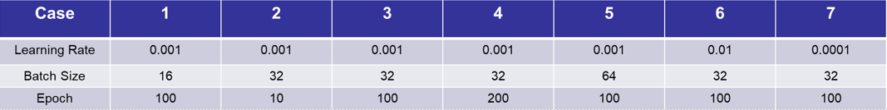

#### Implement Behavior Cloning for Line Following:

##### Dependencies:

(Repeat of the instructions in the `object_recognition` folder)

<u>Note:</u> Use pip to install all the packages. Pip should already be installed, but if it is not, installation instructions can be found [here.](https://pip.pypa.io/en/stable/installing/) If you get a syntax error while using pip upgrade with

```bash
$ pip install -U pip
```

* Install Tensorflow version 1.15 (requires CUDA 10.0)

  ```bash
  $ pip install --user --upgrade tensorflow-gpu==1.15
  ```

  If not training and facing troubles with CUDA installation, then install the CPU only version. 

  ```bash
  $ pip install --user --upgrade tensorflow==1.14
  ```

* Install Keras:

  Install Keras version 2.3.1

  ```bash
  $ pip install keras==2.3.1
  ```

* Install h5py. You will need this to load the models.

  ```bash
  $ pip install h5py
  ```

* Numpy: 

  ```bash
  $ pip install numpy
  ```


* Install the ROS USB cam node to view camera data from the laptop webcam or any connected usb camera

  ```bash
  $ sudo apt-get install ros-<distro>-usb-cam
  ```

  

To test if everything is working, open Python in your terminal and import all the necessary modules. 

```python
import cv2
import rospy
import numpy as np
from std_msgs.msg import String
from sensor_msgs.msg import Image
from cv_bridge import CvBridge, CvBridgeError
import tensorflow 
import keras
```

If there are no errors, you should be able to continue. Resolving any issues and dependencies may take time. 

**Training**

The first step in training would be data collection. However, there are several issues with using Gazebo Sim for collecting training data. Possible reasons:

* The images collected in Gazebo have little to no textures. CNNs have a tendency to bias their weights towards textures. When the textural difference between objects are stark, it is better at recognizing those objects
* When teleoping the vehicle with a keyboard, the steering angle values spend most of their time at the min and max angles with very time spent in between. This is partly due to the mapping of keyboard buttons to steering angles. However, even when using a lane keeping controller to collect the training data the model trained poorly. 

Therefore, you can download the pre-collected training data from the [drive link](https://drive.google.com/drive/folders/1V4SbIxo7ohxFTo1Z0IslWOiT2gmk3DQ9) which was collected in the real world and provided by [Wil Selby](https://www.wilselby.com/2019/12/rc-car-end-to-end-ml-model-development/).

Copy the `/output` folder from the drive into the `/bag2csv` folder. 

To train natively on your PC, set the file-path correctly in  `model_train.py` and execute. (only recommended if you have a powerful enough GPU)

To train on [Google Colab](https://colab.research.google.com/), use the iPython notebook, `behavior_cloning.ipynb`. 


If you would like to collect your own training data anyway, these are the steps to follow:

<u>Create your own training data:</u>

1. Collect training data as a rosbag file. Collect image, throttle and angle information. 
2. Modify `record_training.sh` with the correct topic names to record. Modify topic names in the `bagutils` file. 
3. Use `rosbag_to_csv.py` to convert to csv file:

```bash
$ python rosbag_to_csv.py -i bag_files/ -o output/
```


**Testing Trained Models:**

A number of trained models have already been provided to you. These models have been trained with the above script by changing different parameters:

* Download the models from the [drive link](https://drive.google.com/drive/folders/1V4SbIxo7ohxFTo1Z0IslWOiT2gmk3DQ9).
* Extract the contents to the `behavior_cloning` folder and rename the model from `model_office.json` and `model_office.h5` to `model.json` and `model.h5`.
* In the `drive_model_test.py`, set the appropriate path to the model files and run the file once the gazebo environment and vehicle is spawned.  Use the `line_follow` world to bring up the vehicle in Gazebo.


To keep GitHub from trying to upload this folder when (and if) you push changes to this repo in the future, place it within a ".gitignore" file. The model files are too big to be uploaded onto Github.

*Brief Segue:*  **Git Ignore:**

- Create a file called `.gitignore` in your folder
- Open the file and type the name of the folder you want it to ignore. In this case that folder will be called `models`.
- Now when you push changes, GitHub will ignore this folder.


The question is - which model file? In the drive link, an option of 7 models is provided. For the training of each model file, three kinds of parameters have been altered -- *learning rate*, *batch size*, and the *number of epochs* the model is trained for. 



It is often hard to guess how these parameters affect the end performance of a DL model, but there are some evaluation metrics that allow us to visualize it. 

For each of these models the plots for the following are given:

1. Mean Squared Error (MSE) vs number of epochs
2. Prediction vs True Value
3. Histogram of Predicted Error

What do these terms mean? In this example, how would you describe MSE as an indicator of performance? Which other evaluation metrics can be used? Based on what you see, can you describe which of these models will give you a good behavior?


**Submission**

This is an optional assignment. Submit your responses to the above questions in a word document or a PPT and a video recording of the behavior cloning running in the gazebo world. 

---

<u>Reference</u>: https://www.wilselby.com/2019/12/rc-car-end-to-end-ml-model-development/

