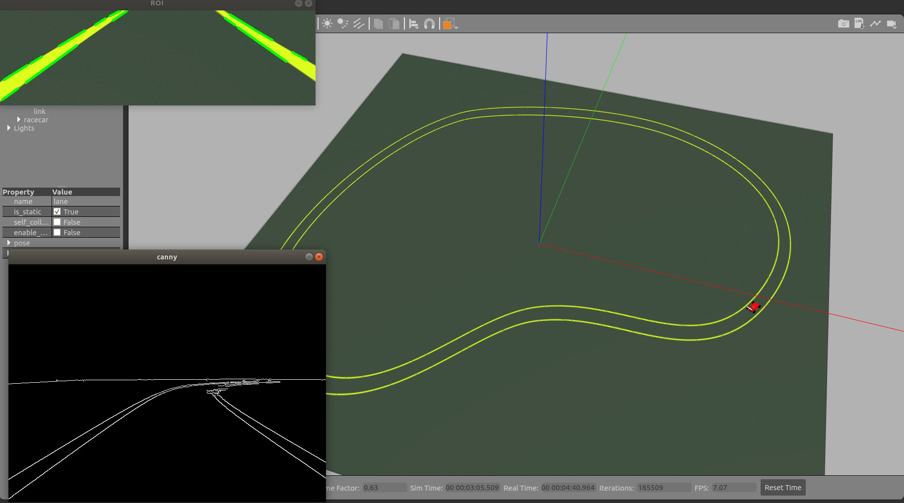
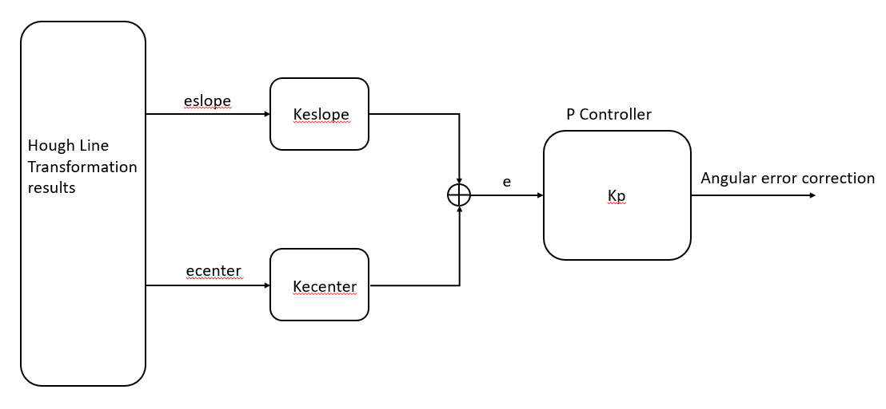

# Autonomous Lane Keeping
In this project we implement an autonomous lane keeping controller by utilizing OpenCV to process the lane track information from video feed and keep the race car on the lance through the course.  

## Team: Group 1
**Members:**
* Atul Hatalkar
* James Ngan
* Robert Aguirre
* Scott Cox
* Vinodkumar Mudaliar
* Zhijian Hua

## Note:
This is Team Group 1's submission for week 6's team project: lane keeping.

## How to run the code
Please follow the steps below to run the code:
1. Clone the code repository into ROS WS on host: **git clone  https://github.com/zhua-intel/bootcamp-assignments.git**
2. Build ROS projects if not already done so: **catkin_make**
3. Run launch file: **roslaunch lane_keeping lane_keep.launch**

## Design Considerations
1. To start the car properly, the race car is placed on a specific track location by the launch file. Without taking this step the problem will have added complexity of how to navigate the car in between the tracks.
2. The camera video feed is used as the source for video processing. The raw video frame will be passed through an OpenCV pipeline that first extract the track edges using canny detector, then crop the resulting edge image and feed it through Hough transformation. A set of line endpoints from the transformation is then  used to generate two types of errors: slope error which indicates the cars bearing against the track direction, as well as distance-to-center error which indicates the distance from the car to the center lane.
3. The total error is calculated by combining both the slope error and distance-to-center error. Each error is weighted by its own coefficient (keslope/kecenter) to adjust its contribution to the total error.  
 
5. The total error is then fed to a simple P-Controller to control the linear and angular velocity of the car.
 

## Results
Video recording for a complete lane keeping run around the course can be found here:  
**./videos/sae_robotics_bootcamp_wk6_lane_keeping.mp4** 

## Controller Evaluation
The controller did quite a good job guiding the car through the course while keeping it on the lane, as the video clips show. 

## Reflections
1. As mentioned earlier, the total error consists of contributions from both slope and distance-to-center errors. By adjusting the weights we can observe the effect from each of the errors. In fact we observed that the car can navigate successfully using only the slope error. One reason is perhaps that the car is placed on the right spot on the lane to begin with, and the overall gentle curvature of the lane makes it possible to navigate with only one type of error input. 

