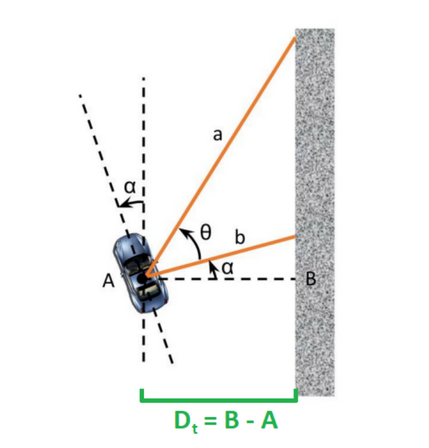
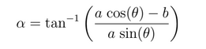
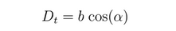

# Wall Following
In this project we implement a wall following controller to allow the race car to follow the curved track while keeping certain distance away from the wall. Two patterns are implemented: following the right wall and following the center line.

## Team: Group 1
**Members:**
* Atul Hatalkar
* James Ngan
* Robert Aguirre
* Scott Cox
* Vinodkumar Mudaliar
* Zhijian Hua

## Note:
This is my individual submission for record. For Group 1 team submission, please see Atul Hatalkar's git submission.

## How to run the code
Please follow the steps below to run the code:
1. Clone the code repository into ROS WS on host: **git clone  https://github.com/zhua-intel/bootcamp-assignments.git**
2. Build ROS projects if not already done so: **catkin_make**
3. Run launch file: **roslaunch wall_following wall_following.launch**
4. Default controller is for **center following**. To switch to right wall following, edit  the **~/sae_ws/ros_ws/src/bootcamp-assignments/wall_following/launch/wall_following.launch** file. Change  teh value of parameter **"following"** inside this line **param name="following" value="center"/** to **"right"**. Then rerun the launch file above to see the car following right wall.

## Design Considerations
1. To follow the wall, it is important to find out the car's position with regard to the wall. If we take the right wall as our reference, here's a diagram showing the relationship between rays and angles: 
 
It then can be deduced the alpha value can be calculated thus: 
 
Once angle alpha is derived, it's easy to find the car's position relative to the right side wall: 
 
2. Given the distance threshold to the right side wall, the error is then calculated as the difference between the actual distance derived above and the threshold. The error is then fed to the pd controller to guide the car.
3. Following the center is quite similar in principle. The extra step is to derive the car's distance to the left side wall. The center line is then the average between the right and left hand side walls. The difference between the center line and current car location is the driving error to be used.
4. The controller used here is a proportional and derivative (pd) controller. To calculate the derivative part, it is required to keep a copy of the previous error and accompanying timestamp. So a rolling error update function is needed for each callback. 

## Results
Video recordings for both center-following and right-wall-following runs can be found here:
**./video/sae_robotics_bootcamp_wk5_wall_following_center.mp4** 
**./video/sae_robotics_bootcamp_wk5_wall_following_right.mp4** 

## Controller Evaluation
The controller did quite a good job guiding the car through the course, as the video clips show. With the addition of emergency brake (explained below), the car is able to navigate the entire track by itself

## Reflections
1. For this particular track there are 2 sharp turns. If we use the controller as is, the car will likely get stuck at these corners. To work around this, we use a sort of emergency brake mechanism. Here we take the lidar distance measurement of 0 degree (directly ahead of the car). If the distance is smaller than the threshold (we use 1.5m in our case), then we apply brake and steer sharply. 
2. If we don't limit the ROS update rate, sometimes the timestamps between updates are too close to show any difference given the ROS granularity (in the range of ms). This would cause a problem  calculating the error derivative as we will get "division bt zero" error. The way my code work around it is instead of calculating derivative for every cycle, I do it for every **other** cycle. This would give me enough time for calculation without running into error.  

